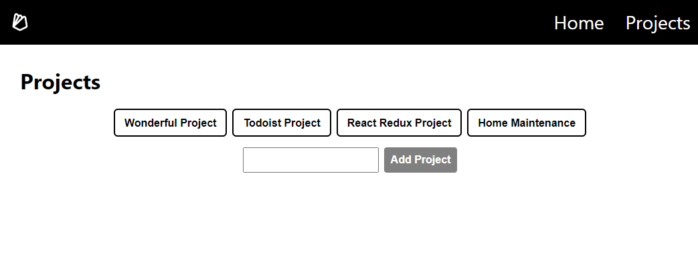
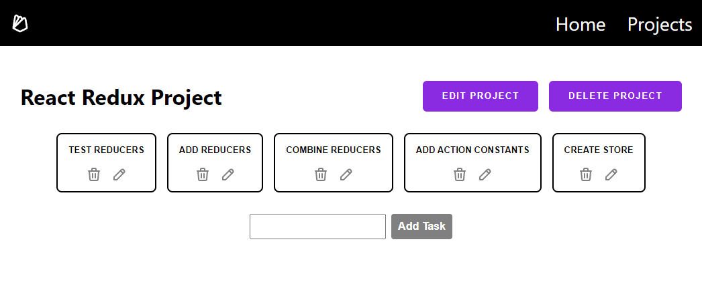

# Mini-Todo App

*An application to practice using Firebase 9, August 2022.*

## Description

This Mini-Todo app is a project management tool where users can add projects and assign tasks to each project. Both the projects and tasks can be edited/updated and deleted.

The goal for this web app is to explore Firebase 9. Data was initially structured as one main collection with sub-collections. This proved difficult to query, as Firebase 9 does not inherently work well with nested data.

Structuring the data into two distinct collections works much better for this case. The 'projects' collection is now separate and distinct from the 'tasks' collection. 'Tasks' are linked / associated with the correct project via a 'projectId'.

## Preview

[Live Demo]()

### Projects Page

### Single Project Page

## Project Specifications

| Behaviour | Input | Output |
| ------------- |:-------------:| ---------:|
| User visits projects page while data array is being populated. | N/A | Loading message displays for slower connections|
| User visits projects page when there are no projects input. | N/A | Message: "Sorry, there are no projects to load. Please add your first project." |
| User types project name and selects 'Add Project' or 'enter key'| Text input: 'React Redux Project' | Loading message & error prompts are replaced with a project button 'React Redux Project' |
| User types nothing and clicks 'Add Project' or presses 'enter key'| N/A | An error message prompts user to provide a project name |
| User clicks the project button | onClick | User routed to project page |
| User types nothing into the Add Task input & clicks 'Add Project'| N/A | An error message prompts user to provide a task name |
| User selects delete task icon| onClick | Task is deleted |
| User selects edit task icon| onClick | User prompted to enter new task name |
| User selects delete project button | onClick | Project tasks & the project itself are all deleted |
| User selects edit project button| onClick | User prompted to enter new project name |

## Setup / Installation Requirements

1. Internet connection required
2. Made for the latest version of Chrome browser
2. [Firebase](https://firebase.google.com/) account with Firestore database set up as a Web app required
3. Download/Clone the repo and install the dependencies (`npm i` or `yarn add`)
4. Create an empty .env file in the projects root directory. __IMPORTANT:__  Test to make sure it is included in your .gitignore, then add your firebase credentials to your .env file.
5. In your terminal, type `npm start` to run in developer mode.

## Known Bugs

~~When User cancels out prompt to edit task/project, it breaks the task/project~~ (fixed)

## Support and Contact Details

*Have a bug or an issue with this application? [Open a new issue](https://github.com/lisawagner/mini-todo/issues) here on GitHub.*

## Technologies Used

1. Firebase 9
2. React 18
3. React Router 6

## License

[MIT](https://choosealicense.com/licenses/mit/)

Copyright (c) 2022 *__Lisa Wagner__*
